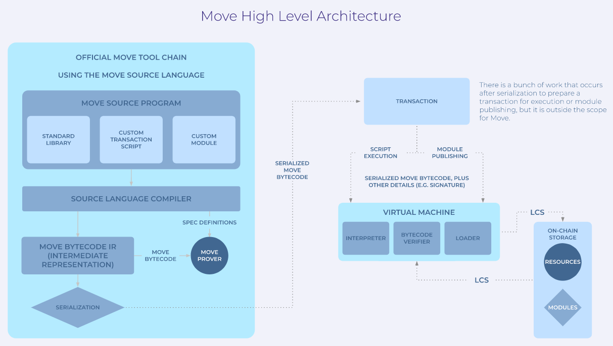
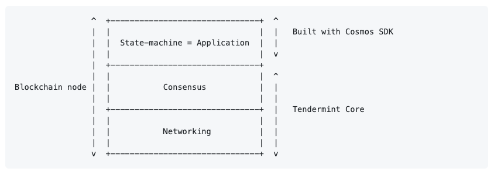

# Smart Contracts

## Overview of Existing Systems Relevant to Store

The Store smart contract architecture borrows inspiration and ideas from several existing project in the space. Some of these technologies are described below.

### Solana Smart Contracts & Runtime

Solana supports smart contracts (referred to as “programs” in the Solana ecosystem) that are compiled via the LLVM compiler infrastructure to an Executable and Linkable Format (ELF) containing a variation of the Berkeley Packet Filter (BPF) bytecode. Because program code is compiled via LLVM, which is a general purpose compilation infrastructure, they can be written in any language which is able to target the LLVM’s BPF backend. Currently, C, C++, and Rust are supported.

Solana has a unique and complex runtime for program execution. The runtime supports partial parallel execution of transactions in contrast to blockchains like Ethereum which always execute in serial. Specifically, the Solana runtime processes transactions which access only read-only accounts in parallel, while transactions accessing writable accounts are executed serially.

The runtime also divides work into two pipelined processes: one used in “leader mode” called the TPU (Transaction Processing Unit), and one used in “validator mode” called the TVU (Transaction Validating Unit). The TPU exists to create ledger entries whereas the TVU exists to validate them.

The Solana client is written in [Rust](https://github.com/solana-labs/solana). A Solana smart contract code snippet, also written in Rust, is given below (full code [here](https://github.com/solana-labs/example-helloworld/blob/master/src/program-rust/src/lib.rs)).

```rust
use borsh::{BorshDeserialize, BorshSerialize};
use solana_program::{
    account_info::{next_account_info, AccountInfo},
    entrypoint,
    entrypoint::ProgramResult,
    msg,
    program_error::ProgramError,
    pubkey::Pubkey,
};

/// Define the type of state stored in accounts
#[derive(BorshSerialize, BorshDeserialize, Debug)]
pub struct GreetingAccount {
    /// number of greetings
    pub counter: u32,
}

// Declare and export the program's entrypoint
entrypoint!(process_instruction);
```

### Diem's Move Language

Diem, formerly Libra, is a permissioned blockchain payment system that was proposed by Facebook in 2019. The network does not yet exist, and may never actually launch given the regulatory backlash the organization faced — but the organization has designed and launched a programming language for the system called Move.

The Move language was designed explicitly for dealing with resources that are currency-like ie. they can be moved, but not replicated arbitrarily. It was also built to be secure and to support formal verification of code.

Move’s [compilation and deployment process](https://developers.diem.com/main/docs/move-introduction#move-architecture) is functionally similar to Rust on Solana and others. Code is compiled to an intermediate bytecode representation, serialized, and deployed on-chain.



The Move language, virtual machine, and compiler are [written in Rust](https://github.com/diem/diem). A code sample is given below.

```rust
script {
    // Import the Debug module published at account address 0x1.
    // 0x1 is shorthand for the fully qualified address
    // 0x00000000000000000000000000000001.
    use 0x1::Debug;

    const ONE: u64 = 1;

    fun main(x: u64) {
        let sum = x + ONE;
        Debug::print(&sum)
    }
}
```

### Tendermint & Cosmos SDK

The Cosmos SDK provides a framework for building Byzantine Fault Tolerant (BFT) blockchains. The SDK pairs Tendermint Core, which handles networking and consensus, to an arbitrary state machine, which defines the properties and functionality of the blockchain. More formally, Tendermint Core performs BFT State Machine Replication (SMR) for arbitrary, deterministic, finite state machines.



Tendermint BFT is a widely used, battle-tested, consensus mechanism which can tolerate up to ⅓ of validators failing in arbitrary ways, including failure by malicious behavior. When combined with an asset native to the chain, Tendermint BFT can function as a Proof-of-Stake consensus mechanism.

The state machine, or “application”, in Cosmos SDK is where the logic for accounts, transactions, and smart contract functionality (if any) are defined. Essentially all aspects of the blockchain are defined in the application layer with the exception of consensus on block contents and ordering, and the networking necessary to communicate transactions and blocks between nodes.

The application layer communicates with Tendermint through the ABCI (Application BlockChain Interface), which the application must implement. Tendermint itself only handles transaction bytes — it has no understanding of what the bytes mean. It simply orders these transaction bytes deterministically. So, when a transaction is sent to the application via the ABCI, the application must decide whether the transaction is valid, as well as the computing and recording of any state change resulting from the transaction. Tendermint simply expects a return code indicating whether the transaction was successfully processed or not.

Cosmos SDK comes with some predefined components which make building an application easier. Communication across the ABCI, for example, is handled by four message types: `CheckTx`, `DeliverTx`, `BeginBlock` and `EndBlock`. The SDK comes with a base boilerplate application which is extended by the user called `baseapp`. It also has a general purpose `multistore` for persisting state. These components provide a starting point for the building of the application, but are general enough to allow for any arbitrary blockchain logic to be defined.

Cosmos SDK is [written in Go](https://github.com/cosmos/cosmos-sdk), but the application logic can be written in any language. A Golang code snippet from Cosmos SDK is given below. This is an example of how `baseapp` is extended (full code [here](https://github.com/cosmos/sdk-tutorials/tree/master/blog/blog)).

```go
type App struct {
 *baseapp.BaseApp
 cdc               *codec.LegacyAmino
 appCodec          codec.Marshaler
 interfaceRegistry types.InterfaceRegistry
 invCheckPeriod uint

 // keys to access the substores
 keys    map[string]*sdk.KVStoreKey
 tkeys   map[string]*sdk.TransientStoreKey
 memKeys map[string]*sdk.MemoryStoreKey

 // keepers
 AccountKeeper    authkeeper.AccountKeeper
 BankKeeper       bankkeeper.Keeper
 CapabilityKeeper *capabilitykeeper.Keeper
 StakingKeeper    stakingkeeper.Keeper
 SlashingKeeper   slashingkeeper.Keeper
 MintKeeper       mintkeeper.Keeper
 DistrKeeper      distrkeeper.Keeper
 GovKeeper        govkeeper.Keeper
 CrisisKeeper     crisiskeeper.Keeper
 UpgradeKeeper    upgradekeeper.Keeper
 ParamsKeeper     paramskeeper.Keeper
 IBCKeeper        *ibckeeper.Keeper
 EvidenceKeeper   evidencekeeper.Keeper
 TransferKeeper   ibctransferkeeper.Keeper

 // make scoped keepers public for test purposes
 ScopedIBCKeeper      capabilitykeeper.ScopedKeeper
 ScopedTransferKeeper capabilitykeeper.ScopedKeeper

 blogKeeper blogkeeper.Keeper
 // the module manager
 mm *module.Manager
}
```

### CosmWasm

[CosmWasm](https://cosmwasm.com/) is a WebAssembly based smart contract module for the Cosmos SDK. WebAssembly (WASM) is a widely used, open standard for portable virtual machines that was designed for the web, but which can run in any environment. WASM can support compilation from any language, and most languages have at least some level of support. Because CosmWasm implements a WASM virtual machine environment for smart contract execution, smart contracts on CosmWasm can be written in almost any language.

An important performance consideration for smart contracts on any blockchain system is the compiled contract data size. Contract data should be as compact as possible as it must be replicated across all nodes in the system and remain there in storage for a long time. WASM code is typically larger than EVM bytecode (for example) as WASM is much more general. To mitigate this larger payload size the CosmWasm project recommends writing contracts in Rust, rather than Go or Haskell, as Rust has no garbage collector and the standard library can be excluded from builds, both of which contribute to a smaller minified build.

The CosmWasm module can be easily plugged into the Cosmos SDK to provide an extensible, customizable, blockchain framework with built-in Turing-complete smart contract support, robust ⅔ BFT consensus, and compatibility with the Cosmos ecosystem tools and support.
